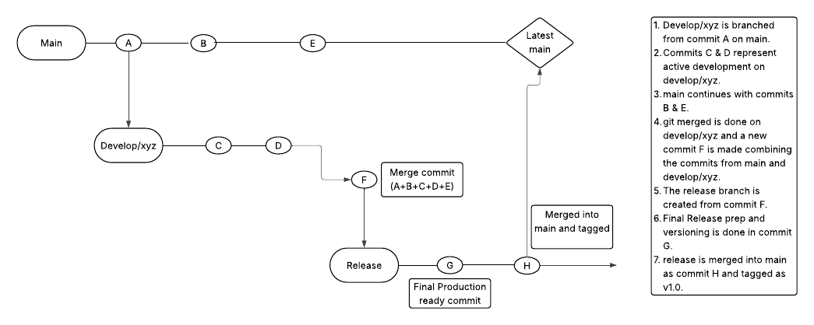

# 📘 Git Branching Strategy – GitFlow


## Strategy Overview

- Enable parallel development
- Maintain a clean `main` branch
- Support safe release practices
- Manage hotfixes and production tagging

---

##  Branch Types

| Branch        | Purpose                                           |
|---------------|---------------------------------------------------|
| `main`        | Always stable. Contains production-ready code.    |
| `develop/*`   | For isolated development of new features.         |
| `release/*`   | For preparing and testing production releases.    |
---

## 📈 Workflow Example



---

## 🔄 Explanation

1. `develop/xyz` is branched from commit `A` on `main`.
2. Commits `C` & `D` represent active development on `develop/xyz`.
3. Meanwhile, `main` continues independently with commits `B` & `E`.
4. `develop/xyz` is merged with `main`, resulting in merge commit `F`.
5. A new `release/1.0` branch is created from commit `F`.
6. Final testing, tagging, and production-ready changes are done in commit `G`.
7. The release is merged back into `main` as commit `H` and tagged (e.g., `v1.0.0`).

---

## 🔧 Git CLI Example

```bash
# Start feature
git checkout -b develop/xyz main

# Work on feature...
git add .
git commit -m "Add new feature XYZ"

# Sync with main
git checkout main
git pull
git checkout develop/xyz
git merge main

# Finish feature
git checkout -b release/1.0
# QA, version updates etc.
git commit -m "Release prep for v1.0"

# Merge and tag
git checkout main
git merge release/1.0
git tag -a v1.0 -m "Release v1.0"
git push origin main --tags
```

---