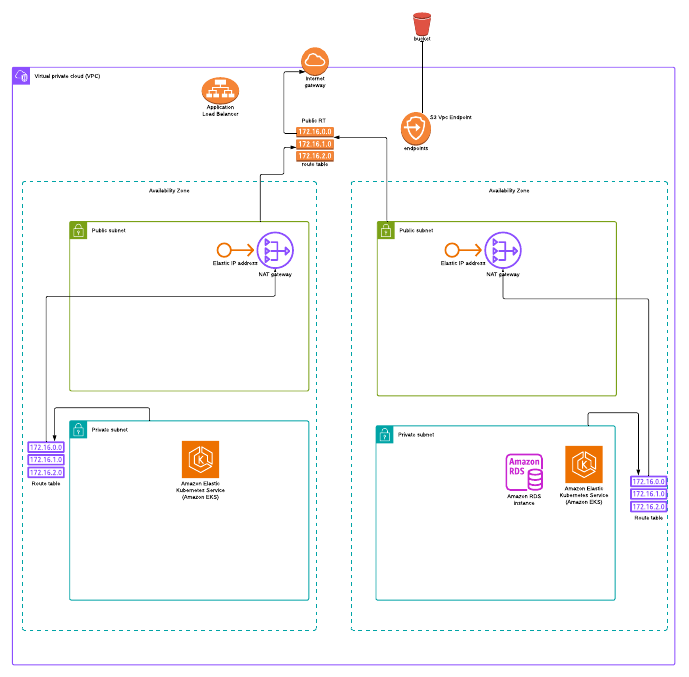

# Flywheel Assessment – AWS Network Architecture

##  Architecture Diagram

---

This document outlines the network architecture implemented using Terraform. The infrastructure is built on AWS with a focus on scalability, fault tolerance, and security.

---

##  VPC Overview

- **VPC CIDR**: `172.16.0.0/16`
- **Availability Zones**: 2 (AZ1 & AZ2)
- **Subnets per AZ**:
  - Public Subnet
  - Private Subnet

---

##  Key Components

### 1. **Public Subnets**
- One public subnet in each AZ
- Configured with `map_public_ip_on_launch = true`
- Connected to the **Internet Gateway** via **Public Route Table**
- Hosts:
  - **NAT Gateways** (1 per AZ)
  - **ALB (Application Load Balancer)** in both public subnets

### 2. **Private Subnets**
- One private subnet in each AZ
- No direct internet access
- Outbound access via **NAT Gateways**
- Hosts:
  - **Amazon EKS Worker Nodes**
  - **Amazon RDS PostgreSQL (Multi-AZ)**

---

##  Routing Setup

###  Public Route Table
- Associated with both public subnets
- Routes:
  - `0.0.0.0/0` → **Internet Gateway**

###  Private Route Tables (1 per AZ)
- Associated with corresponding private subnets
- Routes:
  - `0.0.0.0/0` → **NAT Gateway (in same AZ)**

---

##  Internet Gateway
- Provides public internet access to resources in public subnets
- Used by ALB and NAT Gateways

---

##  NAT Gateways
- 2 NAT Gateways (1 per AZ)
- Each NAT Gateway resides in its respective **public subnet**
- Enables private subnet resources (like EKS and RDS) to access the internet (e.g., for pulling images or installing packages)

---

##  Application Load Balancer (ALB)
- Deployed across both public subnets
- Routes external HTTP traffic to EKS services in private subnets
- Secured with an ALB security group allowing 80/443 ingress

---

##  Amazon S3 + VPC Endpoint
- S3 bucket is provisioned for application storage or Terraform backend
- **S3 Gateway VPC Endpoint** is configured to allow secure access to S3 from private subnets
---

##  Amazon EKS (Elastic Kubernetes Service)
- Control plane is managed by AWS
- Worker nodes deployed in private subnets across AZs for high availability
- EKS nodes communicate with ALB and RDS

---

##  Amazon RDS (PostgreSQL)
- Deployed in **Multi-AZ mode**
- Uses private subnets for enhanced security
- Connected securely with EKS nodes via internal security groups

---

##  Security Considerations
- Public access blocked for all private resources
- **Security Groups** are configured:
  - ALB SG: Allow 80/443 from public
  - EKS SG: Allow traffic from ALB and between nodes
  - RDS SG: Allow traffic from EKS subnets only on port 5432
- S3 bucket:
  - Versioning enabled
  - Encryption enabled
  - Public access blocked

---

##  Scalability and Fault Tolerance
- Multi-AZ design ensures high availability
- EKS node groups and RDS are distributed across AZs
- NAT gateways ensure internet access for each private subnet

---

##  Future Improvements

-  Use **AWS Secrets Manager** or **SSM Parameter Store** for managing DB credentials securely
-  Add observability stack: Prometheus, Grafana, CloudWatch